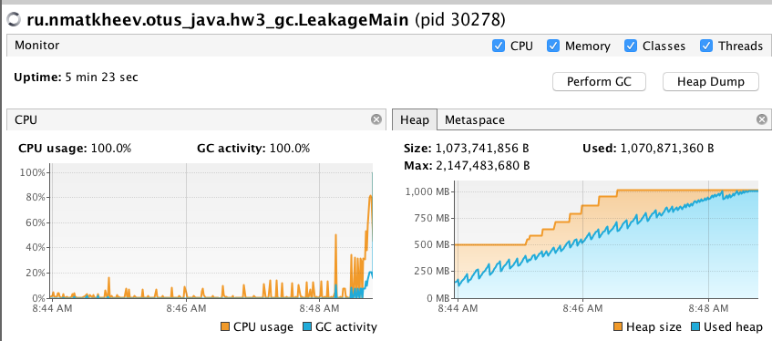
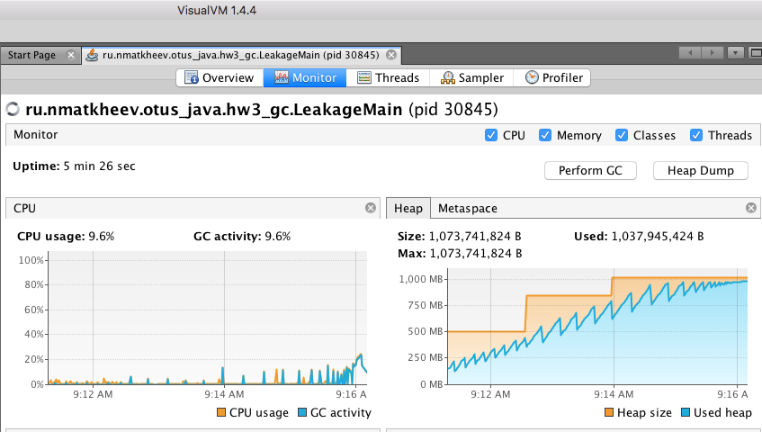
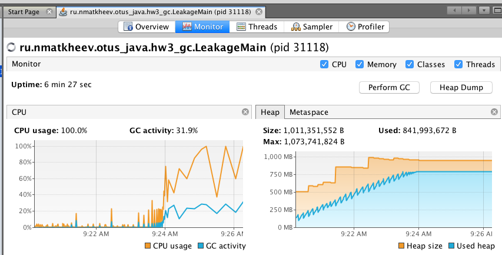

# GC benchmarks    
Конфигурация полигона:  
* Core i5-4270U
* 8GB RAM
* MacOS 10.13
* Oracle JDK 13  

  
#### G1  
parameters:  
```-Xms512m
   -Xmx1024m
   -XX:+HeapDumpOnOutOfMemoryError
   -XX:HeapDumpPath=./logs/dump
   -XX:+UseG1GC
```  



 
#### Serial  
```
-Xms512m
-Xmx1024m
-XX:+HeapDumpOnOutOfMemoryError
-XX:HeapDumpPath=./logs/dump
-XX:+UseSerialGC
```



#### Parallel
```
-Xms512m
-Xmx1024m
-XX:+HeapDumpOnOutOfMemoryError
-XX:HeapDumpPath=./logs/dump
-XX:+UseParallelGC
```


##### CMS  
Не удалось протестировать, удален из JDK13  

##### ZGC
Не удалось протестировать, доступен в JDK13 для Linux  

##### Shenandoah  
Не удалось протестировать, доступен в OpenJDK для Linux    


## Results
### Duration 

metrics|serial_duration|parallel_duration|g1_duration
-------|---------------|-----------------|-----------
count|50.0|57.0|107.0
mean|342.38|175.89473684210526|95.00934579439253
std|188.94280421679503|102.32715116068489|139.2499785120476
min|0.0|19.0|1.0
25%|133.75|62.0|7.0
50%|442.0|225.0|15.0
75%|461.75|241.0|209.0
max|618.0|370.0|452.0

### Categorical frequencies  
metrics|serial_gc|serial_reason|serial_cause|parallel_gc|parallel_reason|parallel_cause|g1_gc|g1_reason|g1_cause
-------|---------|-------------|------------|-----------|---------------|--------------|-----|---------|--------
count|50|50|50|57|57|57|107|107|107
unique|2|2|1|2|2|2|2|2|2
top|MarkSweepCompact|end of major GC|Allocation Failure|PS MarkSweep|end of major GC|Ergonomics|G1 Young Generation|end of minor GC|G1 Evacuation Pause
freq|32|32|50|35|35|35|80|80|104


### Benchmark's outcome  

